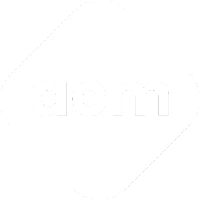

<div align="center">
  <br />
  
  <br />
  
  # GGSIPU EDC ACM Student Chapter Website

  The official web platform for the **GGSIPU East Delhi Campus ACM Student Chapter**.

  [](https://nextjs.org/)
  [](https://www.typescriptlang.org/)
  [](https://tailwindcss.com/)
  [](https://www.framer.com/motion/)
  [](LICENSE)

  **Live Site:** [usar.acm.org](https://usar.acm.org)
</div>

---

## Overview

This platform serves as a central hub for the **GGSIPU East Delhi Campus ACM Student Chapter**, showcasing events, technical blogs, collaborative projects, and team directories. Built with next-generation aesthetics (dark-themed glassmorphism), fluid animations, and mobile responsiveness.

---

## Key Features

- **Immersive Parallax & 3D Elements**: Built with Framer Motion and Three.js (React Three Fiber) for responsive, interactive layouts.
- **Events Dashboard**: Chronological timeline of upcoming, ongoing, and past events with rich modal descriptions.
- **Tech Blogs**: Fast and beautiful blog reading experience with curated articles on emerging tech.
- **Team Showcase**: Displays members behind the chapter, including faculty sponsors, office bearers, and captains.
- **Projects Gallery**: Exhibits projects built by chapter members with full technical specs and links.
- **High Performance**: Built with static HTML exporting for sub-second load times and peak search engine indexing (SEO).
- **Glassmorphic Dark UI**: High-end futuristic aesthetic with clean layouts, typography, and hover micro-animations.

---

## Tech Stack

| Component | Technology Used |
| :--- | :--- |
| **Framework** | [Next.js 16](https://nextjs.org/) (App Router & Static Exporting) |
| **Language** | [TypeScript](https://www.typescriptlang.org/) (Strict Type Safety) |
| **Styling** | [Tailwind CSS](https://tailwindcss.com/) |
| **Animations** | [Framer Motion](https://www.framer.com/motion/) (Smooth transitions & scroll-linked effects) |
| **3D Graphics** | [Three.js](https://threejs.org/) / [React Three Fiber](https://r3f.docs.pmnd.rs/) |
| **Icons** | [Lucide React](https://lucide.dev/) |
| **Deployment** | cPanel / Static File Hosting |

---

## Directory Structure

```
acm-website/
├── public/                 # Static assets (images, logos, fonts, PDFs)
│   ├── home/               # Landing page images (optimized WebP format)
│   ├── team/               # Team member avatars (optimized WebP format)
│   └── fonts/              # Custom brand typography (Montserrat, Bebas Neue)
├── src/
│   ├── app/                # Next.js App Router pages, layout, and global styling
│   ├── components/         # Reusable modular UI components
│   │   ├── about/          # About section sub-components
│   │   ├── blogs/          # Blogs list and reading view components
│   │   ├── events/         # Events display and timeline components
│   │   ├── home/           # Landing page hero, gallery, and awards components
│   │   ├── projects/       # Projects gallery components
│   │   ├── teams/          # Office bearers & domain captains directory
│   │   ├── tesseract/      # Interactive 3D graphics canvas
│   │   └── Marquee.tsx     # Generic parallax-scrolling text marquee (abstracted)
│   ├── data/               # Static dataset source files (blogs, teams, events data)
│   └── lib/                # Shared utilities and helper functions
├── scripts/                # Utility scripts (e.g. image & asset optimizer)
│   └── optimize-images.mjs # Automated utility to convert and shrink assets to WebP
├── next.config.ts          # Next.js export & compilation configs
├── tsconfig.json           # TypeScript configuration
└── package.json            # NPM dependencies & task runners
```

---

## Quick Start

### Prerequisites
Make sure you have [Node.js](https://nodejs.org/) installed (v18.0.0 or higher recommended) along with `npm` or `yarn`.

### 1. Clone & Navigate
```bash
git clone https://github.com/Arsh199965/ACM-Website.git
cd ACM-Website
```

### 2. Install Dependencies
```bash
npm install
```

### 3. Run Development Server
```bash
npm run dev
```
Open [http://localhost:3000](http://localhost:3000) in your browser to view the live hot-reloaded development environment.

---

## Media & Performance Optimization

To maintain sub-second loading speeds, all newly added images must be optimized and converted to WebP before being deployed.

An automated optimization utility is included under `scripts/optimize-images.mjs`. It scans the public folder, downscales oversized images, converts PNG/JPG to WebP, and outputs lightened assets.

To run the optimization utility:
```bash
node scripts/optimize-images.mjs
```

---

## Build & Deployment

To compile the application into fully optimized static pages (saved under the `/out` folder):

```bash
npm run build
```

This output directory (`out/`) is standalone and can be directly uploaded to cPanel, Netlify, Vercel, or any other static file server.

---

## Contributing

We welcome contributions! To contribute:

1. **Fork** the repository.
2. Create a new branch: `git checkout -b feature/amazing-feature`.
3. Make and **commit** your changes: `git commit -m 'Add amazing new feature'`.
4. **Push** your branch: `git push origin feature/amazing-feature`.
5. Open a **Pull Request** detailing your changes.

---

## License

Distributed under the MIT License. See `LICENSE` for more details.
